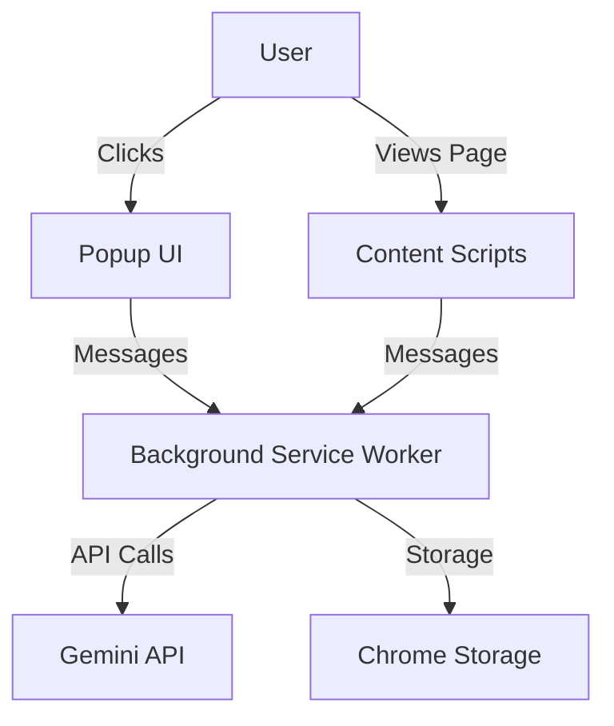

# 🎓 EduVip - Automated Grading & AI Comment Chrome Extension

EduVip là Chrome Extension hỗ trợ tự động hóa quá trình chấm điểm và tạo nhận xét cho hệ thống giáo dục trực tuyến, tích hợp với Google Gemini AI.

## ✨ Tính Năng

### 🤖 Auto Grading
- Tự động điền rating/stars cho tất cả các câu hỏi
- Tự động click nút "Grade" sau khi điền xong
- Hỗ trợ nhiều loại UI: radio buttons, star ratings, MUI components
- Auto-detect grading dialogs và tables

### 💬 AI-Powered Comments
- Tự động phân tích nội dung câu hỏi
- Tạo comment chi tiết bằng Google Gemini AI
- Tự động điền comment vào các trường
- Hỗ trợ textarea, contenteditable, và markdown editors

### 🔒 Security Features
- API key encryption (XOR-based obfuscation)
- Input validation và sanitization
- User-friendly error messages
- Secure storage với chrome.storage.local

### 🎨 Modern UI/UX
- Gradient background với glassmorphism
- Loading states cho tất cả actions
- Real-time status feedback
- Responsive design

## 📦 Installation

### Cài Đặt Từ Source

1. **Clone repository**
   ```bash
   git clone <repository-url>
   cd EduVip
   ```

2. **Load extension vào Chrome**
   - Mở Chrome và truy cập `chrome://extensions/`
   - Bật "Developer mode" ở góc trên bên phải
   - Click "Load unpacked"
   - Chọn thư mục `EduVip`

3. **Verify installation**
   - Extension icon sẽ xuất hiện trên toolbar
   - Click icon để mở popup settings

## ⚙️ Configuration

### 1. Get Gemini API Key

1. Truy cập [Google AI Studio](https://makersuite.google.com/app/apikey)
2. Đăng nhập với Google account
3. Click "Create API Key"
4. Copy API key

### 2. Configure Extension

1. Click extension icon trên toolbar
2. Paste API key vào trường "API Key"
3. (Optional) Tùy chỉnh System Prompt cho AI
4. Click "Save"

### 3. Set Default Rating

- Chọn rating mặc định (1-5 stars)
- Extension sẽ tự động dùng rating này khi auto-grade

### 4. Set Default Comment

- Nhập comment mặc định (optional)
- Dùng cho quick comment không cần AI

## 🚀 Sử Dụng

### Auto Grade

**Cách 1: Via Popup**
1. Mở trang grading
2. Click extension icon
3. Click "Run Auto Grade"

**Cách 2: Via Keyboard Shortcut**
- Press `Ctrl+Shift+9` (Windows/Linux)
- Press `Cmd+Shift+9` (Mac)

**Cách 3: Via Icon Click**
- Click extension icon (không mở popup)

**Auto-detect Mode**:
- Extension tự động detect grading dialogs khi xuất hiện
- Tự động fill ratings sau 250ms debounce

### AI Comment

**Tự động khi click "Reply":**
1. Click button "Reply" hoặc "Trả lời"
2. Extension tự động:
   - Extract nội dung câu hỏi
   - Gọi Gemini AI generate comment
   - Fill comment vào editor
   - (Optional) Auto-click "Send"

**Manual từ Popup:**
1. Nhập comment vào textbox
2. Click "Run Auto Comment"

## 📁 Cấu Trúc Dự Án

```
EduVip/
├── manifest.json           # Extension manifest
├── README.md              # This file
├── src/
│   ├── shared/           # Shared utilities
│   │   ├── errors.js     # Error handling system
│   │   ├── crypto.js     # Encryption utilities
│   │   └── validation.js # Input validation
│   ├── background/       # Background service worker
│   │   ├── index.js      # Main background script
│   │   ├── actions.js    # Action handlers
│   │   ├── constants.js  # Constants
│   │   ├── storage.js    # Storage utilities
│   │   └── gemini.js     # Gemini API integration
│   ├── content/          # Content scripts
│   │   ├── index.js      # Main entry point
│   │   ├── constants.js  # Content constants
│   │   ├── dom.js        # DOM utilities
│   │   ├── rating.js     # Auto-grading logic
│   │   ├── comment.js    # Comment handling
│   │   ├── ai.js         # AI integration
│   │   └── handlers.js   # Event handlers
│   └── popup/            # Extension popup
│       ├── index.html    # Popup UI
│       ├── index.js      # Popup logic
│       ├── popup.css     # Popup styles
│       ├── storage.js    # Settings storage
│       └── ui.js         # UI utilities
```

## 🏗️ Architecture

### Extension Components



### Message Flow

1. **Auto Grade**: Popup → Background → Content Script → DOM
2. **AI Comment**: Content Script → Background → Gemini API → Content Script → DOM
3. **Settings**: Popup → Chrome Storage (encrypted)

### Key Modules

**Shared Modules** (`src/shared/`):
- `errors.js`: Centralized error handling với custom error classes
- `crypto.js`: XOR-based encryption cho API key
- `validation.js`: Input validation và sanitization

**Background** (`src/background/`):
- `gemini.js`: Gemini API integration với model fallback
- `storage.js`: Encrypted storage cho settings
- `actions.js`: Message routing và action handlers

**Content Scripts** (`src/content/`):
- `rating.js`: Auto-grading với MutationObserver
- `comment.js`: Comment field detection và filling
- `ai.js`: AI comment generation workflow
- `handlers.js`: Click và pointer event handlers

## 🔧 Development

### Prerequisites

- Chrome/Edge browser
- Text editor (VS Code recommended)
- Basic JavaScript knowledge

### Making Changes

1. **Edit code** trong `src/` folders
2. **Reload extension**:
   - Vào `chrome://extensions/`
   - Click reload icon trên EduVip card
3. **Test changes** trên target website

## 🤝 Contributing

Contributions are welcome! Để contribute:

1. Fork repository
2. Create feature branch (`git checkout -b feature/AmazingFeature`)
3. Commit changes (`git commit -m 'Add some AmazingFeature'`)
4. Push to branch (`git push origin feature/AmazingFeature`)
5. Open Pull Request

### Coding Standards

- Use ES6+ JavaScript
- Follow existing code style
- Add comments cho complex logic
- Test trước khi commit

## 📄 License

This project is licensed under the MIT License - see the [LICENSE](LICENSE) file for details.

## 🙏 Acknowledgments

- [Google Gemini AI](https://deepmind.google/technologies/gemini/) - AI-powered comments
- Chrome Extensions API - Extension framework
- Material-UI - Design inspiration

## 📞 Support

Nếu gặp issues hoặc có questions:
- Open an issue trên GitHub
- Email: luuchikhanh082004@gmail.com
- Documentation: [Wiki](https://github.com/Kpoi148)
  
Made with ❤️ by Poi
